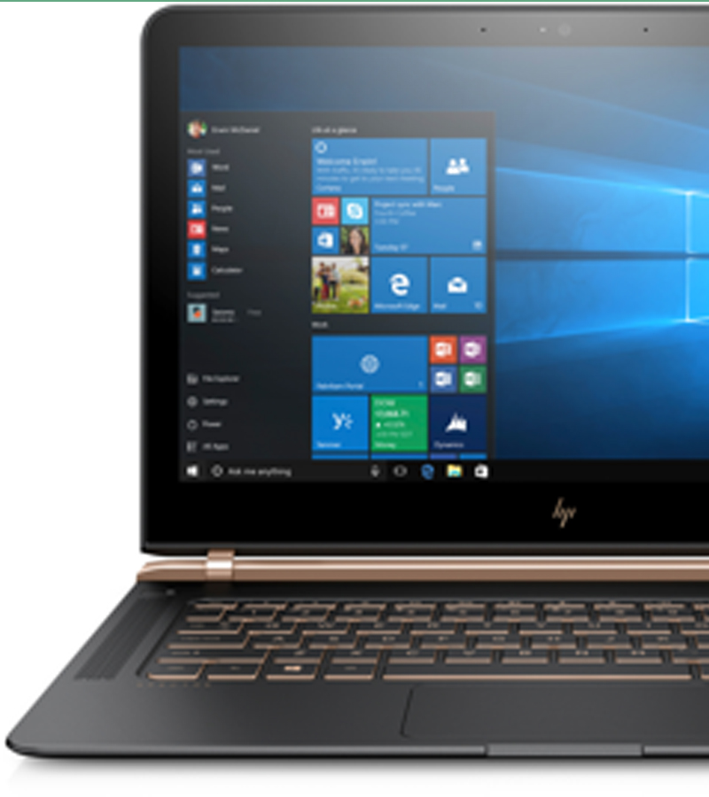
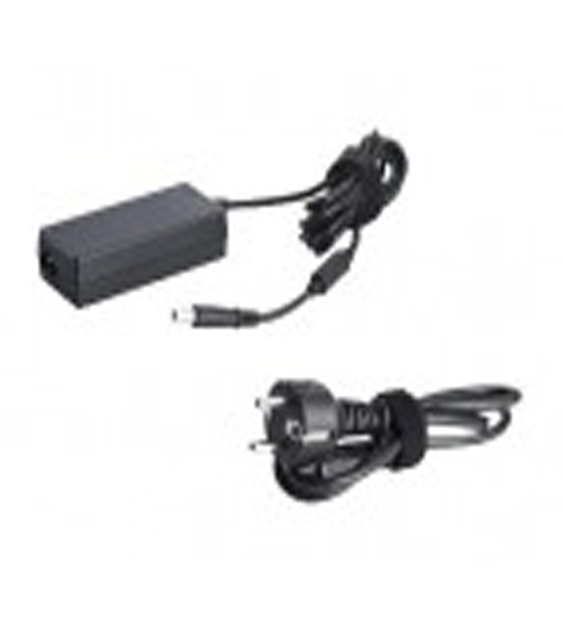

## Quickview functionaliteit

Met de code die is geschreven is men in staat om het advies betreft de quickview technisch te realiseren. Vrij om zelf de vormgeving aan te passen. Het gaat hier puur om de technische realisatie van de functionaliteit.

## Demo
Klik binnen de mappenstructuur op GIT naar de index.html en open deze in de browser. De rest wijst zichzelf.

## Code voorbeeld
Om de quickview functionaliteit te gebruiken moet eerst de de volgende JS file bovenaan de HTML worden ingeladen.
```
<script src="js/modernizr.js"></script>

```
Onderaan de pagina moeten de volgende scripts worden geladen waaronder de jquery:
```
<script src="js/jquery-2.1.1.js"></script>
<script src="js/velocity.min.js"></script>
<script src="js/main.js"></script> <!-- Resource jQuery -->

```
Binnen het quickview paneel is een alert toegevoegd die laat weten of het item in goede orde is toegevoegd.
```
<script>
function myFunction() {
  alert("Het product is toegevoegd aan de offerte!");
}
```
Op de Index.html kun je binnen de cd-items classe je eigen gegevens invullen die zichtbaar zullen zijn voordat de quickview functionaliteit geactiveerd wordt.
```
<ul class="cd-items cd-container">
		<li class="cd-item">
			<br>
			<ul class="noquickview">
			  <h2>HP Elite X2</h2>
					<li>Design en functionaliteit gaan hand in hand met de HP Spectre 13. De behuizing van aluminium en koolstofvezel.</li>
			</ul>
```

Binnen de cd-quick-view kun je de images aanpassen van de quickview.
```
<div class="cd-quick-view">
		<div class="cd-slider-wrapper">
			<ul class="cd-slider">
				<li class="selected"></li>
				<li></li>
				<li></li>
			</ul> 
```
Binnen de cd-item-info kun je onder andere de informatie die bij de images hoort aanpassen.
```
<div class="cd-item-info">
			<h2>HP ProBook 470</h2>
			<h3>Merk: HP</h3><br>
			<p>Design en functionaliteit gaan hand in hand met de HP Spectre 13. De behuizing van aluminium en koolstofvezel is stevig én licht, dus je neemt de Spectre gerust mee naar kantoor.</p>
			<ul class="specificaties">
					<li><i class="material-icons">arrow_forward</i> Intel Core i7-6500U</li>
					<li><i class="material-icons">arrow_forward</i> FHD anti-glare flat LED (1920 x 1080)</li>
					<li><i class="material-icons">arrow_forward</i> 8GB (1 x 8GB) DDR3L SDRAM</li>
```

## Installatie

Download via http://velocityjs.org/ de JS file en laad deze in net boven het einde van het body element

## Waar is het mee gemaakt?

HTML
CSS
Javascript


## Auteur
<b>Camiel de Hoogt</b> - [GitHub](https://github.com/CCDH)
